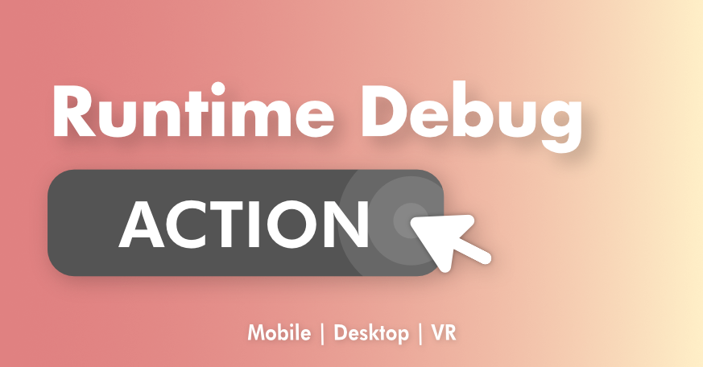

# 🩺 Runtime Debug Action
Welcome to the documentation for RuntimeDebugAction



## Overview
**RuntimeDebugAction** is a runtime debug menu system that lets you register and trigger debug actions with no extra setup. With a set of built-in debug actions and a tiny logger that works out of the box, RDA is built to supercharge your mobile and desktop game development.

> [!WARNING]
> This documentation is still in it's early stages, please notify me if there's anything out of place or not explained well.

## Quick Start

> [!NOTE]
> Take a look at the [QuickStart](manuals/QuickStart/index.html) to get started

## Discord

> Join our [💬discord](https://discord.gg/yHHKfNJeUc) server for quick questions and support!

## Features
- Plug & play debug menu system
- Keyboard & Touch input
- Full Keyboard navigation supported
- The menu is built for mobile 
- Action Type
    - Button (One-shot action)
    - Toggle (On/Off state action)
    - Input (Params input action)
    - Flag (Int based value selector action)
- Mobile Friendly
- Simple searchable menu
- Fluent API for action registering
- Default debug action 
    - Load scene action 
    - Quality settings actions

## Fluent API
The [`RuntimeDebugSystem`](api/BennyKok.RuntimeDebug.Systems.RuntimeDebugSystem.html) class provide the entry point for registering your custom action, with a Fluent API design, it's a joy to add custom actions. 

```csharp
DebugActionBuilder.Button()
    .WithName($"Set {theme.themeName} Theme")
    .WithAction(() =>
    {
        RuntimeDebugSystem.SetTheme(theme, true);
        RuntimeDebugSystem.UIHandler.TogglePanel(true, true);
    })
    .WithGroup("Themes")
);
```