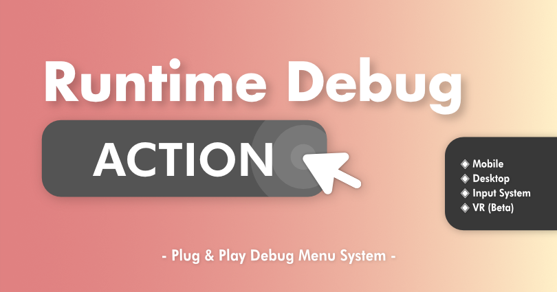

# 🩺 Runtime Debug Action
Welcome to the documentation for RuntimeDebugAction



## Overview
**RuntimeDebugAction** is a runtime debug menu system that lets you register and trigger debug actions with no extra setup. With a set of built-in debug actions and a tiny logger that works out of the box, RDA is built to supercharge your mobile and desktop game development.

> [!WARNING]
> The documentation is still in it's early stages, please let me know me if there's anything out of place or missing.

## Quick Start

> [!NOTE]
> Take a look at the [➜QuickStart](manuals/QuickStart/index.md) to get started

## Discord

> [!NOTE]
> Join our [💬discord](https://discord.com/invite/fHGsArj) server for quick questions and support!

## Features
- Plug & play light weight debug menu system
<br>
- Keyboard navigation & touch input for mobile
<br>
- Support Unity's InputSystem
<br>
- No per scene setup require, auto injected UI system
<br>
- Mobile friendly
<br>
- (Beta) VR Support <a href="https://bennykok.github.io/runtime-debug-action-docs/manuals/VR/index.html">(Docs)</a>
<br>
- Auto register action with reflection <a href="https://bennykok.github.io/runtime-debug-action-docs/manuals/CustomActions/attribute-reflection.html">(Docs)</a>
<br>
&nbsp;&nbsp;&nbsp;&nbsp;- Field (int, float, bool, string, enum)
<br>
&nbsp;&nbsp;&nbsp;&nbsp;- Property (int, float, bool, string, enum)
<br>
&nbsp;&nbsp;&nbsp;&nbsp;- Method
<br>
&nbsp;&nbsp;&nbsp;&nbsp;- Method with parameters (int,float,bool,string)
<br>
- Action Types <a href="https://bennykok.github.io/runtime-debug-action-docs/manuals/CustomActions/index.html#action-type">(Docs)</a>
<br>
&nbsp;&nbsp;&nbsp;&nbsp;- Button (One-shot action) <a href="https://bennykok.github.io/runtime-debug-action-docs/api/BennyKok.RuntimeDebug.Actions.DebugActionButton.html">(Docs)</a>
<br>
&nbsp;&nbsp;&nbsp;&nbsp;- Toggle (On/Off state action) <a href="https://bennykok.github.io/runtime-debug-action-docs/api/BennyKok.RuntimeDebug.Actions.DebugActionToggle.html">(Docs)</a>
<br>
&nbsp;&nbsp;&nbsp;&nbsp;- Input (Params input action) <a href="https://bennykok.github.io/runtime-debug-action-docs/api/BennyKok.RuntimeDebug.Actions.DebugActionInput.html">(Docs)</a>
<br>
&nbsp;&nbsp;&nbsp;&nbsp;- Flag (Int based value selector action) <a href="https://bennykok.github.io/runtime-debug-action-docs/api/BennyKok.RuntimeDebug.Actions.DebugActionFlag.html">(Docs)</a>
<br>
- Searchable menu
<br>
- Logger Panel
<br>
- Custom Actions <a href="https://bennykok.github.io/runtime-debug-action-docs/manuals/CustomActions/index.html">(Docs)</a>
<br>
&nbsp;&nbsp;&nbsp;&nbsp;- Attribute Reflection
<br>
&nbsp;&nbsp;&nbsp;&nbsp;- Fluent API
<br>
&nbsp;&nbsp;&nbsp;&nbsp;- Debug Action Component
<br>
- Support Enter Play Mode Options, faster iteration
<br>
- Built-in debug action <a href="https://bennykok.github.io/runtime-debug-action-docs/manuals/default-actions.html">(Docs)</a>
<br>
- Full source included
<br>

## Demo
Demo Download Link

- Android: [APK file](https://www.dropbox.com/s/qhawrrymrni069h/studiob-runtime-debug-action-demo-default-android-35.apk?dl=1)
- Windows Desktop: [EXE file](https://www.dropbox.com/s/vmom4sfm02vcznl/studiob-runtime-debug-action-demo-default-windows-desktop-64-bit-2.zip?dl=1)

<!-- ## Fluent API
The [`RuntimeDebugSystem`](api/BennyKok.RuntimeDebug.Systems.RuntimeDebugSystem.yml) class provide the entry point for registering your custom action, with a Fluent API design, it's a joy to add custom actions. 

```csharp
DebugActionBuilder.Button()
    .WithName($"Set {theme.themeName} Theme")
    .WithAction(() =>
    {
        RuntimeDebugSystem.SetTheme(theme, true);
        RuntimeDebugSystem.UIHandler.TogglePanel(true, true);
    })
    .WithGroup("Themes")
);
```

More details of registering actions [here](~/manuals/CustomActions/index.md). -->