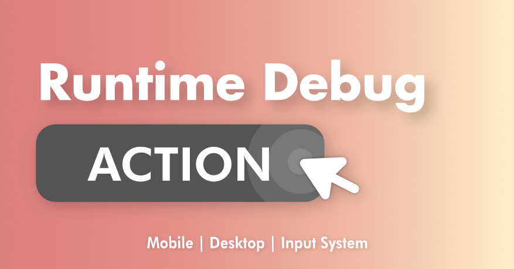

# 🩺 Runtime Debug Action
Welcome to the documentation for RuntimeDebugAction



## Overview
**RuntimeDebugAction** is a runtime debug menu system that lets you register and trigger debug actions with no extra setup. With a set of built-in debug actions and a tiny logger that works out of the box, RDA is built to supercharge your mobile and desktop game development.

> [!WARNING]
> This documentation is still in it's early stages, please notify me if there's anything out of place or not covered.

## Quick Start

> [!NOTE]
> Take a look at the [➜QuickStart](manuals/QuickStart/index.md) to get started

## Discord

> Join our [💬discord](https://discord.com/invite/fHGsArj) server for quick questions and support!

## Features
- Plug & play debug menu system
- Keyboard navigation & touch input for mobile
- Support Unity's InputSystem
- No per scene setup require, auto injected UI system
- <a href="/manuals/CustomActions/index.html#attribute-reflection">Auto register action with reflection</a>
    - Field (int, float, bool, string, enum)
    - Property (int, float, bool, string, enum)
    - Method
    - Method with parameters (int,float,bool,string)
- <a href="/manuals/CustomActions/index.html#action-type">Action Types</a>
    - Button (One-shot action)
    - Toggle (On/Off state action)
    - Input (Params input action)
    - Flag (Int based value selector action)
- Mobile friendly
- <a href="/manuals/VR/index.html">(Beta) *VR Support</a>
- Searchable menu
- Logger Panel
- <a href="/manuals/CustomActions/index.html">Custom Actions</a>
    - Attribute Reflection
    - Fluent API
    - Debug Action Component
- Support Enter Play Mode Options, faster iteration
- <a href="/manuals/default-actions.html">Built-in debug action </a>
- Full source included

## Fluent API
The [`RuntimeDebugSystem`](api/BennyKok.RuntimeDebug.Systems.RuntimeDebugSystem.yml) class provide the entry point for registering your custom action, with a Fluent API design, it's a joy to add custom actions. 

```csharp
DebugActionBuilder.Button()
    .WithName($"Set {theme.themeName} Theme")
    .WithAction(() =>
    {
        RuntimeDebugSystem.SetTheme(theme, true);
        RuntimeDebugSystem.UIHandler.TogglePanel(true, true);
    })
    .WithGroup("Themes")
);
```

More details of registering actions [here](~/manuals/CustomActions/index.md).