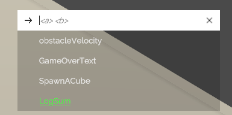
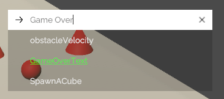
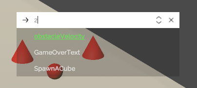

# Attribute Reflection

A newly added feature is the ability to auto register actions in a class with reflection under the hood, which makes the action creation process much easier. Using the [`RuntimeDebugSystem.RegisterActionsAuto`](~/api/BennyKok.RuntimeDebug.Systems.RuntimeDebugSystem.yml#BennyKok_RuntimeDebug_Systems_RuntimeDebugSystem_RegisterActionsAuto_System_Object_System_String_) method, the system will look for all public field, property, method, method with parameters which has a [`DebugAction`](~/api/BennyKok.RuntimeDebug.Attributes.DebugActionAttribute.yml) attribute.

Supported type for field, property
- string
- int
- float
- bool
- enum

Supported type for method with parameter 
- string
- int
- float
- bool

### To register

You can store the action generated somewhere for unregistering.

```csharp
actions = RuntimeDebugSystem.RegisterActionsAuto(this);
```

### To unregister

```csharp
RuntimeDebugSystem.UnregisterActions(actions);
```

### Or simply extends you component from RuntimeDebugBehaviour

Which already handles the registering and unregistering for you.

```csharp
public abstract class RuntimeDebugBehaviour : MonoBehaviour
{
    private BaseDebugAction[] actions;

    protected virtual void Awake()
    {
        actions = RuntimeDebugSystem.RegisterActionsAuto(this);
    }

    protected virtual void OnDestroy()
    {
        RuntimeDebugSystem.UnregisterActions(actions);
    }
}
```

> [!NOTE]
> To prevent any ghost action hanging in the debug menu, it's suggested to handle your actions' unregistration if they were added from any `MonoBehaviour` and maybe disabled or destroy in future, e.g. 
> 1. Register actions in the `OnAwake` and unregister actions in the `OnDestroy`
> 2. Register actions in the `OnEnable` and unregister actions in the `OnDisable`

### [Method] Example Button Action

```csharp
[DebugAction(shortcutKey = "q", closePanelAfterTrigger = true)]
public void SpawnACube()
{
    var bdy = GameObject.CreatePrimitive(PrimitiveType.Cube)
                        .AddComponent<Rigidbody>();

    bdy.gameObject.AddComponent<BoxCollider>();
    bdy.transform.position = new Vector3(0, 3, UnityEngine.Random.Range(-2, 2));
    bdy.transform.localScale = new Vector3(0.5f, 0.5f, 0.5f);
    bdy.AddExplosionForce(2, Vector3.zero, 10);
}
```


### [Method with Parameters] Example Input Action

```csharp
[DebugAction]
public void LogSum(int a, int b)
{
    Debug.Log(a + b);
}
```




### [Property] Example String Input Action

```csharp
[DebugAction]
public string GameOverText
{
    get => gameOverText.text.text;
    set => gameOverText.text.SetText(value);
}
```


### [Field] Example Float Input Action

```csharp
[DebugAction(closePanelAfterTrigger = true)]
public float obstacleVelocity = 2;
```
