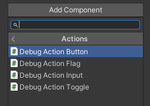

# Debug Action Component

You can define the action name, group, description, etc...

The Unity Action is the `UnityEvent` callback from the menu

The action will automatically appeared in the debug menu

