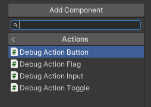
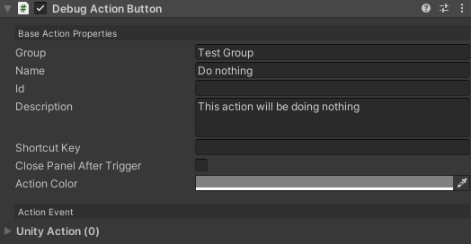
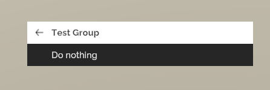

# Building Actions

### Overview

Building custom debug action for your game is extremely easy, and you have two options

1. [Fluent API](#fluent-api)
2. [Debug Action Component](#debug-action-component)

### Fluent API

```csharp
DebugActionBuilder.Button()
    .WithName("Some Action")
    .WithAction(()=>{ });
```

For a full list of common [Fluent APIs](~/api/BennyKok.RuntimeDebug.Actions.FluentAction-1.html)

### Debug Action Component



You can define the action name, group, description, etc...

The Unity Action is the `UnityEvent` callback from the menu



The action will automatically appeared in the debug menu




#### Action Type

| Name | Description |
| ---- | ---- |
| [`Button`](~/api/BennyKok.RuntimeDebug.Actions.DebugActionButton.html) | One-shot action |
| [`Toggle`](~/api/BennyKok.RuntimeDebug.Actions.DebugActionFlag.html) | On/Off state action |
| [`Input`](~/api/BennyKok.RuntimeDebug.Actions.DebugActionInput.html) | Params input action |
| [`Flag`](~/api/BennyKok.RuntimeDebug.Actions.DebugActionFlag.html) | Int based value selector action |