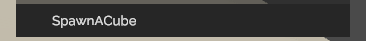
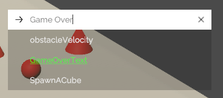

# Adding Actions

## Overview

Adding custom debug action to your game is extremely easy, and you have three options

1. [Attribute Reflection](#attribute-reflection)
2. [Fluent API](#fluent-api)
3. [Debug Action Component](#debug-action-component)

## Attribute Reflection

A newly added feature is the ability to auto register actions in a class with reflection under the hood, which makes the action creation process much easier. Using the [`RuntimeDebugSystem.RegisterActionsAuto`](~/api/BennyKok.RuntimeDebug.Systems.RuntimeDebugSystem.yml#BennyKok_RuntimeDebug_Systems_RuntimeDebugSystem_RegisterActionsAuto_System_Object_System_String_) method, the system will look for all public field, property, method, method with parameters which has a [`DebugAction`](~/api/BennyKok.RuntimeDebug.Attributes.DebugActionAttribute.yml) attribute.

Supported type for field, property
- string
- int
- float
- bool
- enum

Supported type for method with parameter 
- string
- int
- float
- bool

### To register

You can store the action generated somewhere for unregistering.

```csharp
actions = RuntimeDebugSystem.RegisterActionsAuto(this);
```

### To unregister

```csharp
RuntimeDebugSystem.UnregisterActions(actions);
```

### Or simply extends you component from RuntimeDebugBehaviour

Which already handles the registering and unregistering for you.

```csharp
public abstract class RuntimeDebugBehaviour : MonoBehaviour
{
    private BaseDebugAction[] actions;

    protected virtual void Awake()
    {
        actions = RuntimeDebugSystem.RegisterActionsAuto(this);
    }

    protected virtual void OnDestroy()
    {
        RuntimeDebugSystem.UnregisterActions(actions);
    }
}
```

> [!NOTE]
> To prevent any ghost action hanging in the debug menu, it's suggested to handle your actions' unregistration if they were added from any `MonoBehaviour` and maybe disabled or destroy in future, e.g. 
> 1. Register actions in the `OnAwake` and unregister actions in the `OnDestroy`
> 2. Register actions in the `OnEnable` and unregister actions in the `OnDisable`

### [Method] Example Button Action

```csharp
[DebugAction(shortcutKey = "q", closePanelAfterTrigger = true)]
public void SpawnACube()
{
    var bdy = GameObject.CreatePrimitive(PrimitiveType.Cube)
                        .AddComponent<Rigidbody>();

    bdy.gameObject.AddComponent<BoxCollider>();
    bdy.transform.position = new Vector3(0, 3, UnityEngine.Random.Range(-2, 2));
    bdy.transform.localScale = new Vector3(0.5f, 0.5f, 0.5f);
    bdy.AddExplosionForce(2, Vector3.zero, 10);
}
```


### [Method with Parameters] Example Input Action

```csharp
[DebugAction]
public void LogSum(int a, int b)
{
    Debug.Log(a + b);
}
```


### [Property] Example String Input Action

```csharp
[DebugAction]
public string GameOverText
{
    get => gameOverText.text.text;
    set => gameOverText.text.SetText(value);
}
```


### [Field] Example Float Input Action

```csharp
[DebugAction(closePanelAfterTrigger = true)]
public float obstacleVelocity = 2;
```


## Fluent API

The [`DebugActionBuilder`](~/api/BennyKok.RuntimeDebug.Actions.DebugActionBuilder.yml) is the builder class for creating actions.

```csharp
var debugAction = DebugActionBuilder.Button()
    .WithName("Some Action")
    .WithAction(()=>{ });
```

For a full list of common [Fluent APIs](~/api/BennyKok.RuntimeDebug.Actions.FluentAction-1.yml)

### Register Actions

To register any actions

```csharp
RuntimeDebugSystem.RegisterActions(
    DebugActionBuilder.Button()
        .WithName("Your actions")
);
```
> [!NOTE]
> To prevent any ghost action hanging in the debug menu, it's suggested to handle your actions' unregistration if they were added from any `MonoBehaviour` and maybe disabled or destroy in future, e.g. 
> 1. Register actions in the `OnAwake` and unregister actions in the `OnDestroy`
> 2. Register actions in the `OnEnable` and unregister actions in the `OnDisable`


### Unregister Actions

There are few ways to remove actions from the system

#### By group

If you have defined custom path for you actions via `WithGroup("YourGroup")` or the argument `group` in the `RegisterActions` method, you can do as below to remove the actions with same path.

```csharp
RuntimeDebugSystem.UnregisterActionsByGroup(
    "YourGroup"
);
```

#### By references

If you have references to you actions, you can pass them into the `RuntimeDebugAction.UnregisterActions` method directly.

#### By ID

If you have defined a ID for your actions via `WithId("YourId")`, you can do as below to remove the actions with the same ID.

```csharp
RuntimeDebugSystem.UnregisterActionsById(
    "YourId"
);
```


## Debug Action Component


You can define the action name, group, description, etc...

The Unity Action is the `UnityEvent` callback from the menu


The action will automatically appeared in the debug menu


#### Action Type

| Name | Description |
| ---- | ---- |
| [`Button`](~/api/BennyKok.RuntimeDebug.Actions.DebugActionButton.yml) | One-shot action |
| [`Toggle`](~/api/BennyKok.RuntimeDebug.Actions.DebugActionFlag.yml) | On/Off state action |
| [`Input`](~/api/BennyKok.RuntimeDebug.Actions.DebugActionInput.yml) | Params input action |
| [`Flag`](~/api/BennyKok.RuntimeDebug.Actions.DebugActionFlag.yml) | Int based value selector action |