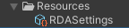

# ➜ Quick Start

### Setup

First, it's recommended to import TextMeshPro's default resources before play, since some of the asset prefabs uses TextMeshPro.

Then make sure your scene have an `EventSystem`.

> [!NOTE]
> If you using Unity's new input system, please [see here](~/manuals/setup-with-input-system.md).

**RuntimeDebugAction** is designed to be plug & play, once you imported the package,
a [`Settings`](~/api/BennyKok.RuntimeDebug.Data.Settings.yml) ScriptableObject will be created in your project folder `Assets/Resources/`.

> [!NOTE]
> If you encountered weird font size of the debug menu after first import, it's because the TextMeshPro's default resource was imported after the prefab's import, you can simply right click on the asset's Prefabs folder and reimport. 

By pressing "Tab", the menu will be enabled, then you will be good to go! You can expect seeing a set of pre-configured debug actions. 

See more details of [default actions](~/manuals/default-actions.md).

On mobile, there will be a touch toggle on the top left of the screen

### Input

RuntimeDebugAction support multiple input method for different platform and input devices, and here is some common use case being tested in development.

| Platform | Device | Input Manager / Input System | Note
| ----------- | ----------- | ----------- | ----------- |
| Standalone | Keyboard | Both | Tested with Windows |
| Standalone | Controller | Input System* | Tested with Xbox controller for Windows |
| Mobile | Touch |  Both  | Tested with Android / iOS |
| VR* | VR Controller | Input System* | Tested with Oculus Quest 2 with Unity XR Interaction Toolkit and Oculus Integration

*For the new Input System setup, please [see here](~/manuals/setup-with-input-system.md). With the Input System enable, its possible to support more input devices for the debug menu navigation with custom input action mapping.

*For setting up with VR project please [see here](~/manuals/vr-setup.md).

> [!NOTE]
> This RDA target desktop and mobile platform primarily, while with Unity's new Input System, Im able to add support for Controller and VR device's input, but I can't guarantee the full potential of RDA especially on VR device, for instance without the keyboard, the shortcut feature won't work in this case.

### Lifecycle

The [`RuntimeDebugSystem`](~/api/BennyKok.RuntimeDebug.Systems.RuntimeDebugSystem.yml) is auto injected to you first scene with the [`RuntimeInitializeOnLoadMethod`](https://docs.unity3d.com/ScriptReference/RuntimeInitializeOnLoadMethodAttribute.html) method.

Then the system GameObject with the UI canvas will be set to `DontDestoryOnLoad` and keeps the debug system alive across scene load.

### Menu Interaction
The debug menu have full keyboard navigation and touch input handling at the same time since the UI prefab is using Unity's normal UI component.

> [!NOTE]
> You are required to have a EventSystem in your scene for event interaction (touch,hover,etc..) of the system to work.

**Default Shortcut Keys**

| Key | Description |
| ----------- | ----------- |
| Tab | Toggle Menu, Exit Input |
| Arrow Up/ Down |  Menu Navigation  |
| Enter | Trigger Action, Enter Group, Confirm Input |

 

**Default Action Shortcut Keys**

Some default actions has shortcut predefined for ease of access.

| Key | Description |
| ----------- | ----------- |
| L | Toggle Logger |

### Settings

To disable the debug menu, go to the **RDASettings** in your project folder `Assets/Resources/`.

There are also other settings you can configure there.

