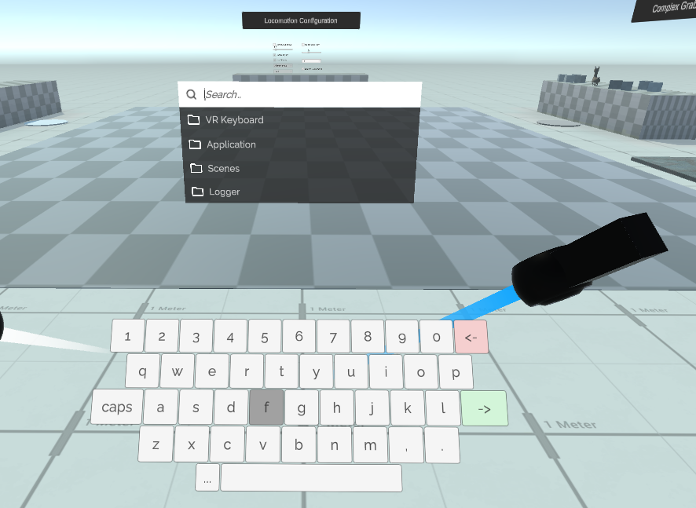
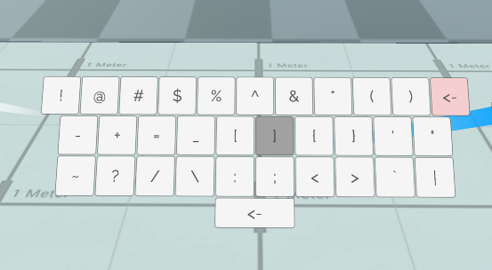
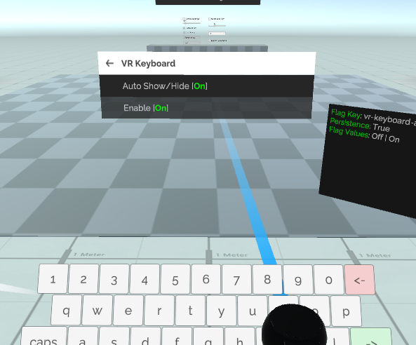

# VR Keyboard

With the VR RDASetting preset applied, the VR specific UI prefab will be used instead, they both contains a simple virtual keyboard for debugging purpose in VR space.

Which provide basic keyboard functions for searching, input actions, triggering shortcut key in VR space.

In order to trigger shortcut key for actions, you will need to disable the auto show/hide in the debug menu, this will keep the keyboard open while the debug menu is closed, only when the debug menu is not visible, the keyboard interaction will be routed to the shortcut action checking. 

