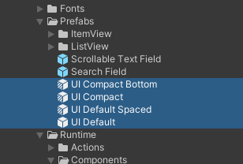
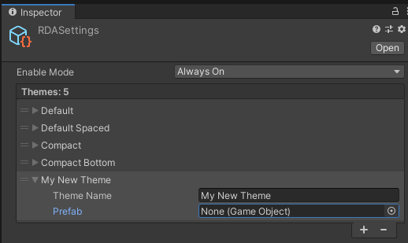
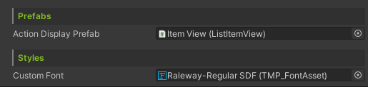

# Custom Themes

### Overview

It's very easy to customize the theme, all the default UI prefabs are located under the `Plugins/RuntimeDebugAction/Prefabs/`.

Duplicate from the UI prefab or create a prefab variant from it for customization.

Then add and assign the new prefab as a new theme in the `RDASettings` located under `Assets/Resources/`.

> [!NOTE]
> Theme at the top is the default theme

### Default Theme List

| Theme UI | Prefab Type |
| ------- | ------- |
| UI Default | Original |
| UI Default Spaced | Variant |
| UI Compact | Variant |
| UI Compact Bottom | Variant |

### Changing font

To assign a different font to the UI prefab, simply import your new font, create a TextMeshPro font asset from it, and assign to the [DebugUIHandler](../api/BennyKok.RuntimeDebug.Components.UI.DebugUIHandler.yml)'s `customFont` field in the inspector of the UI prefab.

