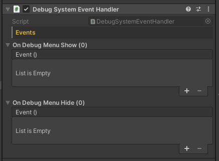

# Debug Menu Event

### Checking if the debug menu is visible

You may want to stop specific code from running if the debug menu is being displayed.

```csharp
if (RuntimeDebugSystem.IsVisible)
```

### Hooking into the event
```csharp
private void OnEnable() => RuntimeDebugSystem.Instance.OnDebugMenuToggleEvent += OnToggle;

private void OnDisable() => RuntimeDebugSystem.Instance.OnDebugMenuToggleEvent -= OnToggle;

public void OnToggle(bool isVisible)
{
    if (isVisible)
        onDebugMenuShow.Invoke();
    else
        onDebugMenuHide.Invoke();
}
```

or directly using the component with UnityEvent

