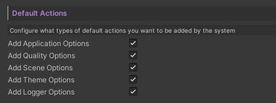
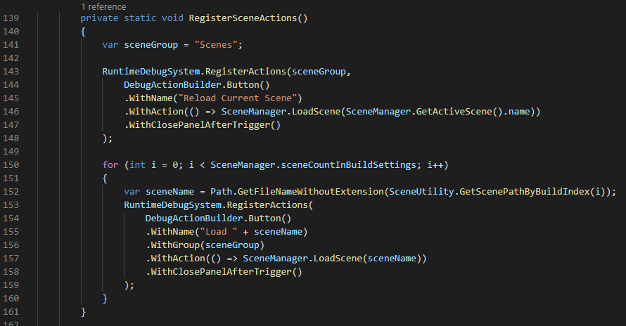

# Default Actions

There's a set of built-in actions that works out of the box. Can be configured from the `RDASettings`.

| Name | Description |
| ---- | ---- |
| Application | Quit/hide cursor/clear player prefs/target fps/cycle orientation action |
| Quality | Cycle quality level/URP specific actions |
| Scene | Reload/Load other scene actions |
| Theme | Change theme actions |
| Logger | Show/hide/clear logger actions |

 

To fully customize the built-in actions, see [DebugActionDefaults](~/api/BennyKok.RuntimeDebug.Systems.DebugActionDefaults.yml) in the assets and edit them directly.

