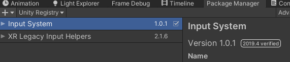
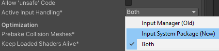
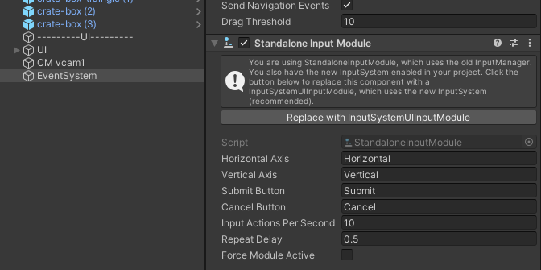
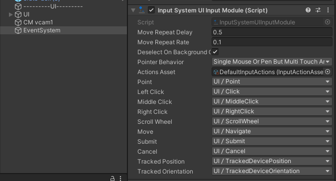
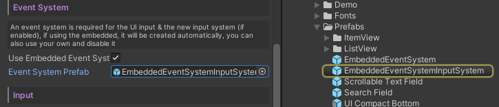
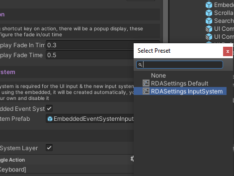

# Setup with Input System

RuntimeDebugAction support input system, to use the new input system. Make sure it's installed and enabled.

In UPM

In player settings

## Event System

### 1. Using your own event system

Then make sure it is replaced with the new Input System UI Input module

### 2. Using the embedded event system

Drag in the EmbeddedEventSystemInputSystem into your RDASettings

or 

loading the preset RDASettings InputSystem

