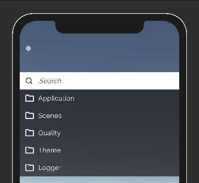
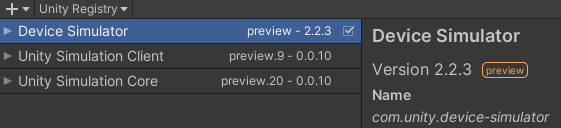
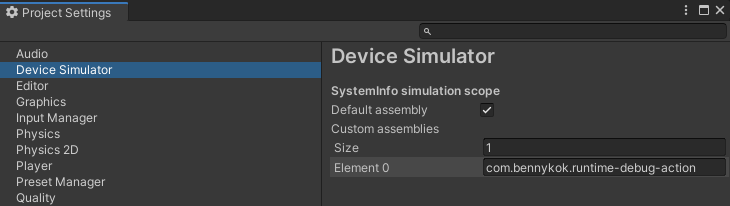

# Testing With Device Simulator

To see how RDA performs on a mobile layout in Unity Editor, use Device Simulator.

First install the Device Simulator from the package manager.

Then go to Device Simulator's project settings and add in `com.bennykok.runtime-debug-action` as a custom assembly.

