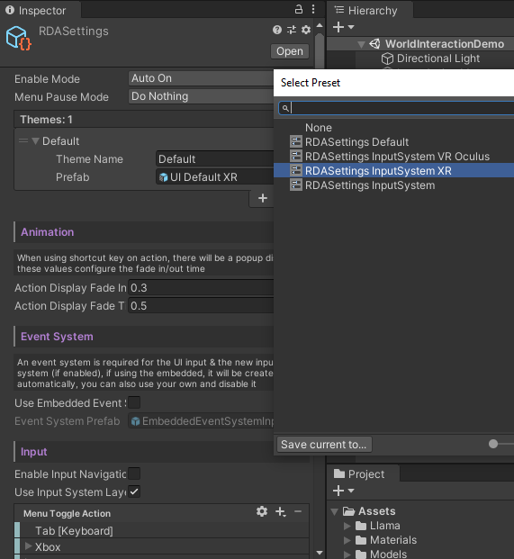

# VR Setup

> [!WARNING]
> Some features are not supported out of the box on VR devices, e.g. menu navigation, action's shortcut (keyboard), debug action input (keyboard), and currently the input on VR only support using Unity InputSystem.

With the VR setup, RDA comes with a specialized UI prefab for VR device. Which will atomically orient the debug menu to your looking direction with smooth damping.

The customized UI prefab, adds the framework specific Graphic Raycaster for all the Canvas components in the prefab.

-  Used by XR Interaction Toolkit

-  Used by Oculus Integration

### VR Input

With VR device, the default input action to toggle the menu has been set to pressing the two secondary button on both of your controller at the same time, so for Quest controller, is the two "Y" button.

## Using XR Interaction Toolkit

https://github.com/Unity-Technologies/XR-Interaction-Toolkit-Examples

If you starting off with Unity's XR Interaction Toolkit, RDA already comes with a settings preset for the XR Interaction Toolkit, and since the XR Interaction Toolkit is now using the InputSystem, head over the RDASettings and apply the "RDASettings InputSystem XR" preset.

### Default Input

With XR Interaction Toolkit, the default trigger action is with the trigger button on your controller while you use the controller pointer like on the mobile touch screen.

### XR Device Simulator

If you don't have device to test, you can use the "XR Device Simulator"

From UPM, import "XR Device Simulator" from the samples, then drag and drop the simulator into the scene. 

Everything should be ready to go.

## Using Oculus Integration

If you are using Oculus Integration instead, apply the "RDASettings InputSystem VR Oculus" preset.

If you are not familiar with Oculus Integration, read more on Oculus Developer site https://developer.oculus.com/documentation/unity/unity-import/

And you will need to also activate the new Input System with Oculus Integration, make sure it is set to both.

### Default Input

With XR Interaction Toolkit, the default trigger action is with the "A" button (primary button) on your controller while you use the controller pointer like on the mobile touch screen.